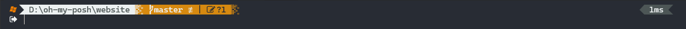

# Oh My Posh Theme for PowerShell

This [Oh My Posh](https://ohmyposh.dev/) theme for PowerShell is designed to display useful information such as the user, operating system, path, Git status, and battery status.

## Theme Preview





## Configuration

Here is an excerpt of the configuration used in this theme:

```json
{
  "$schema": "https://raw.githubusercontent.com/JanDeDobbeleer/oh-my-posh/main/themes/schema.json",
  "final_space": true,
  "version": 3,
  "palette": {
    "red": "#b03a2e",
    "orange": "#ef7d00",
    "green": "#317703",
    "purple": "#744d89",
    "brown": "#54433a",
    "white": "#ecf0f1",
    "gray": "#4d5656",
    "lightgray": "#7b7a7a",
    "git-modified": "#d68910",
    "git-diverged": "#b03a2e",
    "git-ahead": "#744d89",
    "git-behind": "#744d89",
    "battery-charging": "#b8e994",
    "battery-discharging": "#fff34e",
    "battery-full": "#33DD2D"
  },
  "blocks": [
    {
      "description": "Prompt block: display the user, os, path, git branch and status",
      "type": "prompt",
      "alignment": "left",
      "newline": true,
      "segments": [
        {
          "description": "Root segment: display a red flash when the user is root",
          "type": "root",
          "style": "diamond",
          "trailing_diamond": "\ue0b0",
          "foreground": "p:red",
          "background": "p:white",
          "template": " \uf0e7 "
        },
        {
          "description": "OS segment: display the OS icon",
          "type": "os",
          "style": "diamond",
          "trailing_diamond": "\ue0b0",
          "foreground": "p:orange",
          "background": "transparent",
          "template": " {{ .Icon }} "
        },
        {
          "description": "Path segment: display the path with a different color for writable directories",
          "type": "path",
          "style": "diamond",
          "trailing_diamond": "\ue0c6",
          "foreground": "p:gray",
          "foreground_templates": [
            "{{if .Writable}}p:gray{{else}}p:red{{end}}"
          ],
          "background": "p:white",
          "template": " {{ .Path }} ",
          "properties": {
            "style": "agnoster_full"
          }
        },
        {
          "description": "Git segment: display the git branch and status",
          "type": "git",
          "style": "diamond",
          "trailing_diamond": "\ue0c6",
          "foreground": "p:white",
          "background": "p:green",
          "background_templates": [
            "{{ if or (.Working.Changed) (.Staging.Changed) }}p:git-modified{{ end }}",
            "{{ if and (gt .Ahead 0) (gt .Behind 0) }}p:git-diverged{{ end }}",
            "{{ if gt .Ahead 0 }}p:git-ahead{{ end }}",
            "{{ if gt .Behind 0 }}p:git-behind{{ end }}"
          ],
          "template": "  {{ .HEAD }}{{if .BranchStatus }} {{ .BranchStatus }}{{ end }}{{ if .Working.Changed }} <transparent>|</> <transparent>\uf044 {{ .Working.String }}</>{{ end }}{{ if .Staging.Changed }} <transparent>\ue0b1</> <transparent>\uf046 {{ .Staging.String }}</>{{ end }}{{ if gt .StashCount 0 }} <transparent>\ue0b1</> <transparent>\ueb4b {{ .StashCount }}</>{{ end }} ",
          "properties": {
            "fetch_stash_count": true,
            "fetch_status": true,
            "fetch_upstream_icon": true,
            "fetch_worktree_count": true,
            "mapped_branches": {
              "feat/*": "🚀 ",
              "bug/*": "🐛 "
            }
          }
        }
      ]
    },
    {
      "description": "Prompt block: display the battery status",
      "type": "prompt",
      "alignment": "right",
      "segments": [
        {
          "description": "Battery segment: display the battery status",
          "type": "battery",
          "style": "diamond",
          "leading_diamond": "\ue0b2",
          "invert_powerline": true,
          "foreground": "p:gray",
          "background": "p:orange",
          "background_templates": [
            "{{if eq \"Charging\" .State.String}}p:battery-charging{{end}}",
            "{{if eq \"Discharging\" .State.String}}p:battery-discharging{{end}}",
            "{{if eq \"Full\" .State.String}}p:battery-full{{end}}"
          ],
          "properties": {
            "charged_icon": "\uf240 ",
            "charging_icon": "\uf1e6 ",
            "discharging_icon": "\ue234 "
          },
          "template": " {{ if not .Error }}{{ .Icon }}{{ .Percentage }}% <transparent>\ue0b2</>{{ end }}"
        },
        {
          "description": "This segment generates a space to separate the battery status from the next segment",
          "type": "text",
          "style": "plain",
          "foreground": "transparent",
          "background": "transparent",
          "template": "_"
        },
        {
          "description": "Execution time segment: display the execution time of the last command",
          "type": "executiontime",
          "style": "diamond",
          "leading_diamond": "\ue0b2",
          "invert_powerline": true,
          "foreground": "p:white",
          "background": "p:gray",
          "template": " {{ .FormattedMs }} <transparent>\ue0b2</>",
          "properties": {
            "always_enabled": true,
            "style": "austin"
          }
        }
      ]
    },
    {
      "description": "",
      "type": "prompt",
      "alignment": "left",
      "newline": true,
      "segments": [
        {
          "type": "status",
          "style": "plain",
          "foreground": "p:white",
          "background": "transparent",
          "foreground_templates": [
            "{{ if .Error }}p:red{{ end }}"
          ],
          "properties": {
            "always_enabled": true,
            "status_template": "{{ if .Error }}\uf090{{ else }}\uf08b{{ end }}"
          }
        }
      ]
    }
  ]
}
```
